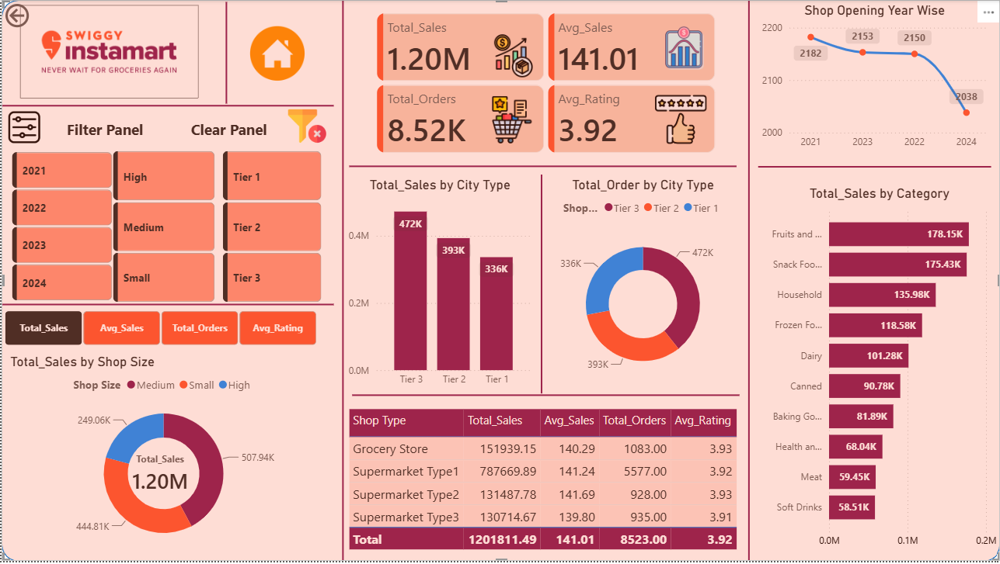

# Swiggy Instamart Sales Analysis Dashboard
## Project Overview
The Swiggy Instamart Sales Analysis Dashboard is an interactive Power BI project designed to analyze sales performance and provide actionable business insights. The dashboard transforms raw sales data into meaningful visualizations, helping stakeholders monitor key business metrics and make data-driven decisions.

---
## Dashboard Preview

## Objective
The primary objective of this project is to:
- Analyze overall sales performance.
- Track Total Sales, Orders, Average Sales, and Customer Ratings.
- Compare sales across different Shop Types and Shop Sizes.
- Analyze sales performance by City Tier.
- Identify the highest-selling Product Categories.
- Monitor shop opening year trends.
- Create an interactive dashboard for business users.
---
## Tools & Technologies
- Power BI Desktop
- Power Query
- DAX (Data Analysis Expressions)
- Microsoft Excel
---
## Dataset
The dataset contains sales information related to Swiggy Instamart, including:
- Orders
- Sales
- Product Categories
- Shop Types
- Shop Sizes
- City Tier
- Customer Ratings
- Shop Opening Year
---
## Data Preparation
The following data preparation steps were performed:
- Imported multiple Excel files.
- Cleaned and transformed data using Power Query.
- Removed duplicates and handled missing values.
- Corrected data types.
- Merged and appended tables where required.
- Built relationships between tables.
- Created a Star Schema data model.
---
## DAX Measures Created
Some important DAX measures used in this project include:
- Total Sales
- Total Orders
- Average Sales
- Average Rating
---
## Dashboard Features
### KPI Cards
- Total Sales
- Average Sales
- Total Orders
- Average Rating
### Interactive Filters
- Shop Opening Year
- Shop Size
- City Tier
### Visualizations
- Sales by Shop Size
- Sales by City Tier
- Orders by City Tier
- Sales by Category
- Shop Opening Year Trend
- Shop Type Performance Table
---
## Key Insights
- Total Sales reached approximately **1.20 Million**.
- More than **8,500 orders** were recorded.
- Tier 3 cities generated the highest sales.
- Fruits and Snack Foods were the best-performing categories.
- Average customer rating remained close to **3.9**.
- Supermarket Type 1 generated the highest number of orders.
---
## Skills Demonstrated
This project demonstrates the following Power BI skills:
- Data Cleaning
- Data Transformation
- DAX Measures
- KPI Development
- Interactive Dashboard Design
- Business Storytelling
- Data Visualization
---
## Author
**Nishi Kumari Yadav**

Aspiring Data Analyst
Skilled in Power BI, Excel, Power Query, DAX, and Data Visualization.

---
## License
This project is licensed under the MIT License.
